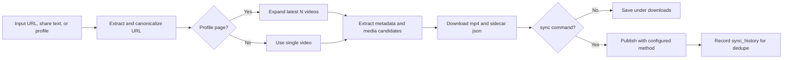

# videocp

`videocp` is a Python CLI for downloading videos from Douyin, Bilibili, Xiaohongshu, Instagram, YouTube, and other sites supported by `yt-dlp`. It can also sync the latest videos from configured source profiles and publish them to QQ channels.

Douyin and Xiaohongshu use a dedicated copied Chrome profile plus CDP extraction. Bilibili defaults to a built-in Python TV-mode downloader modeled after BBDown. Generic sites are routed through `yt-dlp` with browser cookies exported when possible.

## Features

| Feature | Description |
| --- | --- |
| Single video download | Supports Douyin, Bilibili, Xiaohongshu, Instagram, YouTube, and generic `yt-dlp` sites |
| Profile download | Supports Douyin user pages, Bilibili spaces, Xiaohongshu user pages, Instagram reels, YouTube shorts/videos |
| Batch input | Accepts multiple command-line URLs or a txt file |
| Link preparation | Extracts URLs from copied share text and writes canonical links |
| QQ channel sync | Reads `tasks.yaml`, downloads new videos, dedupes via history, and publishes |
| Browser login reuse | Uses an app-owned Chrome profile so authenticated sites can work |
| Bilibili TV mode | Opens a QR login page once if no cached TV token exists |
| Optional watermark removal | Can detect and remove Bilibili watermarks through Gemini/OpenRouter plus ffmpeg delogo |

Output is organized as:

```text
downloads/{site}-{author}/{content_id}.mp4
downloads/{site}-{author}/{content_id}.json
```

The JSON sidecar records metadata, source URLs, chosen download candidate, attempts, and diagnostics.

## Workflow



## Install

```bash
python3 -m pip install -e '.[dev]'
```

If the `videocp` script is not available in your shell, run through the project virtual environment:

```bash
.venv/bin/python -m videocp --help
```

External tools:

| Tool | Required | Purpose |
| --- | --- | --- |
| Chrome-family browser | Yes | CDP extraction, login reuse, visible Bilibili TV QR login, QQ channel web publishing |
| `ffmpeg` | Recommended | HLS fallback, video/audio muxing, watermark removal |
| `yt-dlp` | Recommended | YouTube, Instagram, and generic site downloads |

macOS:

```bash
brew install ffmpeg yt-dlp
```

Before the first real download or sync, log in to the sites you need in your normal browser, such as Bilibili, Douyin, Xiaohongshu, Instagram, YouTube, and QQ channels.

## First Run And Login

Check browser, profile, CDP, ffmpeg, and yt-dlp:

```bash
videocp doctor
```

Common checks:

| Check | Meaning |
| --- | --- |
| `browser_detect` | Whether a Chrome-family browser was found |
| `profile_seed` | Whether the app-owned browser profile was prepared |
| `ffmpeg` | Whether ffmpeg is available |
| `ytdlp` | Whether yt-dlp is available |
| `cdp_startup` | Whether the browser can start and expose CDP |

For interactive login, keep the visible browser open. Finish logging in, then return to the terminal and press Enter to close the browser and save the profile state.

```bash
videocp doctor --no-headless --keep-open
```

Open specific login sites:

```bash
videocp doctor --no-headless --keep-open \
  --login-url https://www.douyin.com/ \
  --login-url https://www.bilibili.com/ \
  --login-url https://www.xiaohongshu.com/ \
  --login-url https://pd.qq.com/
```

## Single Video Download

```bash
videocp download '<video URL or copied share text>'
```

Examples:

```bash
videocp download '7.86 复制打开抖音，看看【示例】 https://v.douyin.com/xxxxxx/'
videocp download 'https://www.bilibili.com/video/BV1764y1y76G/'
videocp download 'https://www.douyin.com/video/1234567890'
videocp download 'https://www.xiaohongshu.com/explore/69be081c0000000021010b12?xsec_token=...'
videocp download 'https://www.youtube.com/watch?v=dQw4w9WgXcQ'
videocp download 'https://www.instagram.com/reel/DWQQpz5lLZD/'
```

Specify output directory:

```bash
videocp download 'https://www.douyin.com/video/1234567890' --output-dir ./downloads
```

Print JSON for scripting:

```bash
videocp download 'https://www.douyin.com/video/1234567890' --json
```

Run with a visible browser:

```bash
videocp download '<url>' --no-headless
```

## Profile Download

Passing a profile URL expands it to recent videos first. The default count comes from `download.profile_videos_count` in `config.yaml`.

```bash
videocp download 'https://www.douyin.com/user/MS4wLjABAAAAxxxxxx'
videocp download 'https://space.bilibili.com/7612168'
videocp download 'https://www.xiaohongshu.com/user/profile/5756c80da9b2ed37b185c08e'
videocp download 'https://www.instagram.com/ddk69k/reels/'
videocp download 'https://www.youtube.com/@hackbearterry/shorts'
videocp download 'https://www.youtube.com/@hackbearterry/videos'
```

Override the count:

```bash
videocp download 'https://space.bilibili.com/7612168' --profile-videos-count 5
```

Notes:

- Douyin profile expansion skips pinned videos and downloads recent videos.
- Bilibili space downloads use built-in TV mode; the first run may require QR scan.
- YouTube, Instagram, and generic profile-like URLs rely on `yt-dlp` where possible.

## Batch Input

Pass multiple inputs:

```bash
videocp download \
  'https://www.douyin.com/video/111' \
  'https://www.douyin.com/video/222'
```

Prepare canonical links from mixed URLs or share text:

```bash
videocp prepare-list \
  --output-file ./links.txt \
  'https://www.douyin.com/jingxuan?modal_id=7596491775800282387' \
  'https://www.bilibili.com/video/BV1764y1y76G/'
```

Download from a file:

```bash
videocp download --input-file ./links.txt
```

`links.txt` uses one URL or share text per line. Empty lines and lines starting with `#` are ignored.

## Sync To QQ Channel

`videocp sync` and `video sync` are equivalent. The command fetches latest videos from configured source profiles, downloads new items, publishes them with the configured method, and writes history for dedupe.

Typical flow:

```bash
# Check browser/CDP first
video doctor

# Dry run without downloading or publishing
video sync --dry-run

# Run all tasks from tasks.yaml
video sync

# Run one task
video sync --task-name douyin-example

# Process only the latest 1 video per task
video sync --count 1

# JSON output
video sync --json
```

Sync steps:

1. Read `tasks.yaml`.
2. Expand each task source profile to latest videos.
3. Check `sync_history.json` and skip processed items.
4. Download video files to `downloads`.
5. Publish with `publish_method`.
6. Append `sync_logs/YYYY-MM-DD.log`.

## tasks.yaml

Minimal example:

```yaml
sync:
  history_file: ./sync_history.json
  skill_dir: ~/.claude/skills/tencent-channel-community/
  videos_per_task: 3
  publish_method: skill
  skip_rate: 0.2

tasks:
  - name: "douyin-example"
    source_url: "https://www.douyin.com/user/MS4wLjABAAAAxxxxxx"
    title_template: "{desc}"
```

CDP publish example:

```yaml
sync:
  history_file: ./sync_history.json
  videos_per_task: 1
  publish_method: cdp

tasks:
  - name: "bilibili-to-channel"
    source_url: "https://space.bilibili.com/7612168"
    guild_id: "657469764024457583"
    title_template: "{desc}"
```

Task fields:

| Field | Description |
| --- | --- |
| `sync.history_file` | Dedupe history file |
| `sync.skill_dir` | Local `tencent-channel-community` skill path for `publish_method: skill` |
| `sync.videos_per_task` | Default latest video count per task |
| `sync.publish_method` | Global publish method: `skill`, `cdp`, or `youtube` |
| `sync.skip_rate` | Random skip probability; pinned videos are always synced |
| `sync.max_video_duration_secs` | Optional max duration filter; `0` disables it |
| `tasks[].name` | Unique task name used for filtering and history |
| `tasks[].source_url` | Source profile URL or single video URL |
| `tasks[].guild_id` | Required for `publish_method: cdp` |
| `tasks[].title_template` | Supports `{desc}`, `{title}`, `{author}`, `{site}`, `{content_id}` |
| `tasks[].content_template` | Supports the same placeholders |
| `tasks[].feed_type` | Feed type used by skill publishing |
| `tasks[].count` | Per-task override for `videos_per_task` |
| `tasks[].publish_method` | Per-task override for publish method |
| `tasks[].skip_rate` | Per-task override for random skip probability |

Publish methods:

| Method | Use case | Notes |
| --- | --- | --- |
| `skill` | Publish through local `tencent-channel-community` skill | Publishes with author identity; configured `guild_id` / `channel_id` are ignored |
| `cdp` | Publish through real QQ channel web page | Requires `guild_id` and a logged-in browser |
| `youtube` | Publish to YouTube | Requires a logged-in browser |

Sync notes:

- Entries with status `ok`, `skipped_unavailable`, `skipped_random`, or `skipped_duration` are treated as processed and skipped later.
- If a source video is unavailable, such as YouTube members-only content, sync marks it as `skipped_unavailable` instead of failing the whole run.
- After a successful `cdp` publish, the browser page stays open briefly before closing.

## Configuration

The CLI reads `config.yaml`, and `sync` also reads `tasks.yaml`, searching from the current directory upward. CLI arguments override config values.

```yaml
download:
  output_dir: ./downloads
  max_concurrent: 3
  max_concurrent_per_site: 1
  start_interval_secs: 0
  profile_videos_count: 3

browser:
  profile_dir: ~/Library/Caches/videocp/chrome-profile
  browser_path: ""
  headless: true

request:
  timeout_secs: 30

watermark:
  enabled: false
  # api_key: ""  # falls back to OPENROUTER_API_KEY env var
  base_url: https://openrouter.ai/api/v1/chat/completions
  model: google/gemini-3-flash-preview
```

Config fields:

| Field | Description |
| --- | --- |
| `download.output_dir` | Output directory |
| `download.max_concurrent` | Total concurrent download jobs |
| `download.max_concurrent_per_site` | Per-site concurrency limit |
| `download.start_interval_secs` | Delay between starting jobs |
| `download.profile_videos_count` | Default latest video count for profile URLs |
| `browser.profile_dir` | App-owned Chrome profile directory |
| `browser.browser_path` | Chrome executable path; empty means auto-detect |
| `browser.headless` | Whether to run without a visible browser window |
| `request.timeout_secs` | Page and request timeout |
| `watermark.enabled` | Enable Bilibili watermark detection/removal |

Common CLI overrides:

```bash
videocp download '<url>' --output-dir ./tmp --no-headless --timeout-secs 60
videocp download '<profile-url>' --profile-videos-count 10
videocp download '<url>' --browser-path '/Applications/Google Chrome.app/Contents/MacOS/Google Chrome'
videocp download --input-file ./links.txt --json
```

## Demo Script

Suggested order for a short internal demo:

```bash
# 1. Commands and environment
videocp --help
videocp doctor --no-headless --keep-open --login-url https://www.bilibili.com/

# 2. Single video download
videocp download 'https://www.bilibili.com/video/BV1764y1y76G/'

# 3. Prepare copied share text into a txt list
videocp prepare-list --output-file ./links.txt '<copied share text>'
cat ./links.txt

# 4. Batch download from file
videocp download --input-file ./links.txt

# 5. Profile latest N videos
videocp download 'https://space.bilibili.com/7612168' --profile-videos-count 3

# 6. Sync dry run
video sync --dry-run --count 1
```

Use `--no-headless --keep-open` during the first demo so people can see login and QR flows. Switch back to headless mode once the profile is ready.

## Troubleshooting

| Symptom | Possible cause | Fix |
| --- | --- | --- |
| `No Chrome-family browser found` | Chrome-family browser is missing or not auto-detected | Install Chrome or pass `--browser-path` |
| `doctor --no-headless` closes quickly | `doctor` is a health check by default | Use `videocp doctor --no-headless --keep-open` |
| `cdp_startup` fails | Browser cannot start or CDP port is unavailable | Retry with `--no-headless`; check browser path and profile permissions |
| Douyin/Xiaohongshu cannot extract video | Not logged in, anti-bot page, expired link | Log in first and retry with `--no-headless` |
| First Bilibili download waits for login | TV mode needs one-time QR authorization | Scan the QR code; token is cached afterward |
| YouTube/Instagram download fails | `yt-dlp` missing or authenticated cookies unavailable | Install `yt-dlp` and confirm browser login |
| HLS download or muxing fails | `ffmpeg` missing | Install ffmpeg |
| `download --input-file` skips a line | Empty lines and `#` comments are ignored | Check that the line contains a real URL |
| `sync` keeps skipping an item | Existing record in `sync_history.json` | Confirm it was already processed; edit only that history entry if needed |
| `sync --task-name` finds no task | Task name mismatch | Copy the exact `tasks[].name` value |

## Safety Notes

- Do not commit or share `.env`, browser profiles, cookies, or account tokens.
- `sync_history.json` and `sync_logs/` may include publish records, share URLs, and local video paths.
- `downloads/` contains the actual videos; follow copyright and internal distribution rules.
- For new sync tasks, run `video sync --dry-run --count 1` before publishing.
- For new publishing setup, run visible mode first, then switch back to `headless: true`.

## Additional Notes

- First run copies local Chrome profile state into an app-owned cache directory; later runs sync newly added browser profiles into that copied profile.
- Download runs reuse a dedicated Chrome instance, reconnect to an already running instance when possible, and open one tab per input.
- Browser extraction and file downloads can overlap across inputs while reusing the same Chrome instance.
- The downloader tries no-watermark candidates first and falls back to stable playable assets.
- Single-video pages and user profile pages are supported. Live streams, albums, and playlists are out of scope.
- URLs not matching built-in providers are automatically routed to `yt-dlp`.
