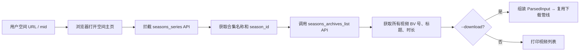

# videocp

`videocp` 是一个用于下载视频的 Python 命令行工具，支持抖音、B 站、小红书、Instagram、YouTube，以及其他 `yt-dlp` 支持的网站。它也可以按配置从来源账号拉取最新视频，并同步发布到 QQ 频道。

抖音和小红书通过独立复制的 Chrome profile 加 CDP 抓取视频信息；B 站默认使用内置的 TV 模式下载流程，逻辑参考 BBDown；其他通用网站会交给 `yt-dlp` 处理，并在可行时导出浏览器 cookie 以复用登录态。

## 功能

| 功能 | 说明 |
| --- | --- |
| 单视频下载 | 支持抖音、B 站、小红书、Instagram、YouTube，以及通用 `yt-dlp` 网站 |
| 主页批量下载 | 支持抖音用户主页、B 站空间、小红书用户主页、Instagram reels、YouTube shorts/videos |
| B 站合集下载 | 列出或下载 B 站用户空间的合集/系列视频 |
| 批量输入 | 支持命令行传多个 URL，也支持从 txt 文件读取 |
| 链接整理 | 从复制分享文案中提取 URL，并写出规范链接列表 |
| QQ 频道同步 | 读取 `tasks.yaml`，下载新视频，基于历史记录去重，并发布 |
| 浏览器登录复用 | 使用工具专用 Chrome profile，让需要登录的网站也能下载 |
| B 站 TV 模式 | 没有缓存 TV token 时，会打开二维码登录页扫码一次 |
| B 站多模式下载 | 支持 `tv`（1080P）、`web`（4K，需 Cookie）、`ytdlp`（720P）三种下载策略 |
| 可选水印处理 | 可通过 Gemini/OpenRouter 加 ffmpeg delogo 检测并移除 B 站水印 |

下载输出目录结构：

```text
downloads/{site}-{author}/{content_id}.mp4
downloads/{site}-{author}/{content_id}.json
```

同名 JSON sidecar 会记录元信息、来源 URL、最终选择的下载候选、尝试过程和诊断信息。

## 工作流程


## 安装

推荐使用 `uv` 管理虚拟环境和依赖：

```bash
# 如果还没有安装 uv
brew install uv

# 创建或更新 .venv，并安装项目依赖和开发依赖
uv sync --extra dev
```

后续可以直接通过 `uv run` 执行命令：

```bash
uv run videocp --help
uv run videocp doctor
```

如果已经激活 `.venv`，也可以直接使用 `videocp`：

```bash
source .venv/bin/activate
videocp --help
```

外部工具：

| 工具 | 是否必须 | 用途 |
| --- | --- | --- |
| Chrome 系浏览器 | 必须 | CDP 抓取、登录态复用、B 站 TV 二维码登录、QQ 频道网页发布 |
| `ffmpeg` | 推荐 | HLS 兜底、音视频合并、水印处理 |
| `yt-dlp` | 推荐 | YouTube、Instagram 和其他通用网站下载 |

macOS：

```bash
brew install ffmpeg yt-dlp
```

第一次正式下载或同步前，先在自己的常用浏览器里登录需要访问的平台，例如 B 站、抖音、小红书、Instagram、YouTube 和 QQ 频道。

## 首次检查和登录

检查浏览器、profile、CDP、ffmpeg、yt-dlp 是否可用：

```bash
videocp doctor
```

常见检查项：

| 检查项 | 含义 |
| --- | --- |
| `browser_detect` | 是否找到 Chrome 系浏览器 |
| `profile_seed` | 是否成功准备工具专用浏览器 profile |
| `ffmpeg` | 是否找到 ffmpeg |
| `ytdlp` | 是否找到 yt-dlp |
| `cdp_startup` | 浏览器是否能启动并暴露 CDP 端口 |

如果需要手动登录，让可见浏览器保持打开。登录完成后回到终端按回车，浏览器会关闭并保存 profile 状态。

```bash
videocp doctor --no-headless --keep-open
```

也可以直接打开指定登录站点：

```bash
videocp doctor --no-headless --keep-open \
  --login-url https://www.douyin.com/ \
  --login-url https://www.bilibili.com/ \
  --login-url https://www.xiaohongshu.com/ \
  --login-url https://pd.qq.com/
```

## 单视频下载

```bash
videocp download '<视频 URL 或复制分享文案>'
```

示例：

```bash
videocp download '7.86 复制打开抖音，看看【示例】 https://v.douyin.com/xxxxxx/'
videocp download 'https://www.bilibili.com/video/BV1764y1y76G/'
videocp download 'https://www.douyin.com/video/1234567890'
videocp download 'https://www.xiaohongshu.com/explore/69be081c0000000021010b12?xsec_token=...'
videocp download 'https://www.youtube.com/watch?v=dQw4w9WgXcQ'
videocp download 'https://www.instagram.com/reel/DWQQpz5lLZD/'
```

指定输出目录：

```bash
videocp download 'https://www.douyin.com/video/1234567890' --output-dir ./downloads
```

输出 JSON，便于脚本调用：

```bash
videocp download 'https://www.douyin.com/video/1234567890' --json
```

使用可见浏览器运行：

```bash
videocp download '<url>' --no-headless
```

## 主页批量下载

传入账号主页 URL 时，`videocp` 会先展开最近视频，再逐条下载。默认数量来自 `config.yaml` 中的 `download.profile_videos_count`。

```bash
videocp download 'https://www.douyin.com/user/MS4wLjABAAAAxxxxxx'
videocp download 'https://space.bilibili.com/7612168'
videocp download 'https://www.xiaohongshu.com/user/profile/5756c80da9b2ed37b185c08e'
videocp download 'https://www.instagram.com/ddk69k/reels/'
videocp download 'https://www.youtube.com/@hackbearterry/shorts'
videocp download 'https://www.youtube.com/@hackbearterry/videos'
```

临时覆盖下载数量：

```bash
videocp download 'https://space.bilibili.com/7612168' --profile-videos-count 5
```

说明：

- 抖音主页展开会跳过置顶视频，只下载最近视频。
- B 站空间下载使用内置 TV 模式，第一次可能需要扫码。
- YouTube、Instagram 和其他通用主页类 URL 会尽量通过 `yt-dlp` 处理。

## B 站合集下载

`videocp series` 可以列出或下载 B 站用户空间中的合集/系列视频。它会通过浏览器拦截空间页面的 API 请求，获取合集中的所有视频，再复用已有的单视频下载管线。

### 列出合集

```bash
# 列出某用户的所有合集
videocp series 'https://space.bilibili.com/102438649'

# 只看指定合集内的视频列表
videocp series 'https://space.bilibili.com/102438649' --season-id 2072518

# JSON 格式输出，便于脚本处理
videocp series 'https://space.bilibili.com/102438649' --json
```

### 下载合集

```bash
# 下载指定合集的所有视频
videocp series 'https://space.bilibili.com/102438649' --season-id 2072518 --download

# 使用 web 模式（4K）下载
videocp series 'https://space.bilibili.com/102438649' --season-id 2072518 --download --bb-mode web

# 无头模式下载
videocp series 'https://space.bilibili.com/102438649' --season-id 2072518 --download --headless
```

工作流程：



算法：通过 Playwright 打开用户空间页，拦截 B 站前端自行调用的 `seasons_series` 和 `seasons_archives_list` API，解析出合集元数据和视频列表。下载时直接拿到 BV 号，复用内置的 B 站下载管线（tv/web/ytdlp）。

## 批量输入

命令行传多个输入：

```bash
videocp download \
  'https://www.douyin.com/video/111' \
  'https://www.douyin.com/video/222'
```

把混合 URL 或分享文案整理成规范链接：

```bash
videocp prepare-list \
  --output-file ./links.txt \
  'https://www.douyin.com/jingxuan?modal_id=7596491775800282387' \
  'https://www.bilibili.com/video/BV1764y1y76G/'
```

从文件批量下载：

```bash
videocp download --input-file ./links.txt
```

`links.txt` 每行放一个 URL 或分享文案。空行和以 `#` 开头的注释行会被忽略。

## 同步到 QQ 频道

`videocp sync` 和 `video sync` 等价。该命令会从配置的来源主页拉取最新视频，下载新内容，按配置方式发布，并写入历史记录用于去重。

常用流程：

```bash
# 先检查浏览器/CDP
video doctor

# 演练模式：不下载、不发布
video sync --dry-run

# 按 tasks.yaml 跑全部任务
video sync

# 只跑一个任务
video sync --task-name douyin-example

# 每个任务只处理最新 1 条
video sync --count 1

# JSON 输出
video sync --json
```

同步步骤：

1. 读取 `tasks.yaml`。
2. 将每个任务的来源主页展开为最新视频。
3. 查询 `sync_history.json`，跳过已处理内容。
4. 下载视频文件到 `downloads`。
5. 按 `publish_method` 发布。
6. 追加写入 `sync_logs/YYYY-MM-DD.log`。

## tasks.yaml

最小示例：

```yaml
sync:
  history_file: ./sync_history.json
  skill_dir: ~/.claude/skills/tencent-channel-community/
  videos_per_task: 3
  publish_method: skill
  skip_rate: 0.2

tasks:
  - name: "douyin-example"
    source_url: "https://www.douyin.com/user/MS4wLjABAAAAxxxxxx"
    title_template: "{desc}"
```

CDP 发布示例：

```yaml
sync:
  history_file: ./sync_history.json
  videos_per_task: 1
  publish_method: cdp

tasks:
  - name: "bilibili-to-channel"
    source_url: "https://space.bilibili.com/7612168"
    guild_id: "657469764024457583"
    title_template: "{desc}"
```

任务字段：

| 字段 | 说明 |
| --- | --- |
| `sync.history_file` | 去重历史文件 |
| `sync.skill_dir` | `publish_method: skill` 使用的本地 `tencent-channel-community` skill 路径 |
| `sync.videos_per_task` | 每个任务默认处理的最新视频数量 |
| `sync.publish_method` | 全局发布方式：`skill`、`cdp` 或 `youtube` |
| `sync.skip_rate` | 随机跳过概率；置顶视频总是同步 |
| `sync.max_video_duration_secs` | 可选最长时长过滤；`0` 表示禁用 |
| `tasks[].name` | 任务唯一名称，用于过滤和历史记录 |
| `tasks[].source_url` | 来源主页 URL 或单视频 URL |
| `tasks[].guild_id` | `publish_method: cdp` 必填 |
| `tasks[].title_template` | 支持 `{desc}`、`{title}`、`{author}`、`{site}`、`{content_id}` |
| `tasks[].content_template` | 支持同样的占位符 |
| `tasks[].feed_type` | skill 发布使用的帖子类型 |
| `tasks[].count` | 单任务覆盖 `videos_per_task` |
| `tasks[].publish_method` | 单任务覆盖发布方式 |
| `tasks[].skip_rate` | 单任务覆盖随机跳过概率 |

发布方式：

| 方式 | 适用场景 | 注意事项 |
| --- | --- | --- |
| `skill` | 通过本地 `tencent-channel-community` skill 发布 | 按作者身份发布；配置的 `guild_id` / `channel_id` 会被忽略 |
| `cdp` | 通过真实 QQ 频道网页发布 | 需要 `guild_id`，且浏览器已登录 |
| `youtube` | 发布到 YouTube | 需要浏览器已登录对应账号 |

同步说明：

- 状态为 `ok`、`skipped_unavailable`、`skipped_random` 或 `skipped_duration` 的记录会被视为已处理，后续会跳过。
- 如果来源视频不可下载，例如 YouTube 会员专属内容，sync 会标记为 `skipped_unavailable`，而不是让整次任务失败。
- `cdp` 发布成功后，浏览器页面会短暂停留再关闭。

## 配置

CLI 会从当前目录向上查找 `config.yaml`；`sync` 还会读取 `tasks.yaml`。命令行参数优先级高于配置文件。

```yaml
download:
  output_dir: ./downloads
  max_concurrent: 3
  max_concurrent_per_site: 1
  start_interval_secs: 0
  profile_videos_count: 3

# B站下载策略: tv(默认1080P/无需大会员) | web(需Cookie/支持4K) | ytdlp(无登录/最高720P)
bilibili:
  download_mode: tv

browser:
  profile_dir: ~/Library/Caches/videocp/chrome-profile
  browser_path: ""
  headless: true

request:
  timeout_secs: 30

watermark:
  enabled: false
  # api_key: ""  # falls back to OPENROUTER_API_KEY env var
  base_url: https://openrouter.ai/api/v1/chat/completions
  model: google/gemini-3-flash-preview
```

配置字段：

| 字段 | 说明 |
| --- | --- |
| `download.output_dir` | 输出目录 |
| `download.max_concurrent` | 总并发下载任务数 |
| `download.max_concurrent_per_site` | 单平台并发限制 |
| `download.start_interval_secs` | 任务启动间隔 |
| `download.profile_videos_count` | 主页 URL 默认展开的最新视频数量 |
| `bilibili.download_mode` | B 站下载策略：`tv`（1080P）、`web`（4K）、`ytdlp`（720P） |
| `browser.profile_dir` | 工具专用 Chrome profile 目录 |
| `browser.browser_path` | Chrome 可执行文件路径；为空时自动探测 |
| `browser.headless` | 是否无可见窗口运行 |
| `request.timeout_secs` | 页面和请求超时时间 |
| `watermark.enabled` | 是否启用 B 站水印检测/移除 |

常用命令行覆盖：

```bash
videocp download '<url>' --output-dir ./tmp --no-headless --timeout-secs 60
videocp download '<profile-url>' --profile-videos-count 10
videocp download '<url>' --browser-path '/Applications/Google Chrome.app/Contents/MacOS/Google Chrome'
videocp download --input-file ./links.txt --json
videocp series 'https://space.bilibili.com/102438649' --season-id 2072518 --download --headless
```

## 演示脚本

内部分享可以按下面顺序演示：

```bash
# 1. 查看命令和环境
videocp --help
videocp doctor --no-headless --keep-open --login-url https://www.bilibili.com/

# 2. 单视频下载
videocp download 'https://www.bilibili.com/video/BV1764y1y76G/'

# 3. 把复制分享文案整理成 txt 链接列表
videocp prepare-list --output-file ./links.txt '<复制来的分享文案>'
cat ./links.txt

# 4. 从文件批量下载
videocp download --input-file ./links.txt

# 5. 抓取主页最新 N 条视频
videocp download 'https://space.bilibili.com/7612168' --profile-videos-count 3

# 6. 查看 B 站合集
videocp series 'https://space.bilibili.com/325864133'

# 7. 同步任务演练
video sync --dry-run --count 1
```

第一次演示建议用 `--no-headless --keep-open`，方便看到登录和扫码流程。profile 准备好后再切回无头模式。

## 常见问题

| 现象 | 可能原因 | 处理方式 |
| --- | --- | --- |
| `No Chrome-family browser found` | 没安装 Chrome 系浏览器，或无法自动探测 | 安装 Chrome，或传 `--browser-path` |
| `doctor --no-headless` 窗口很快关闭 | `doctor` 默认只是健康检查 | 使用 `videocp doctor --no-headless --keep-open` |
| `cdp_startup` 失败 | 浏览器无法启动，或 CDP 端口不可用 | 用 `--no-headless` 重试，检查浏览器路径和 profile 权限 |
| 抖音/小红书无法提取视频 | 未登录、遇到风控页、链接失效 | 先登录，再用 `--no-headless` 重试 |
| B 站第一次下载等待登录 | TV 模式需要一次二维码授权 | 扫码登录；token 后续会缓存 |
| YouTube/Instagram 下载失败 | 缺少 `yt-dlp`，或没有可用登录态 cookie | 安装 `yt-dlp`，确认浏览器已登录 |
| HLS 下载或音视频合并失败 | 缺少 `ffmpeg` | 安装 ffmpeg |
| `download --input-file` 跳过某一行 | 空行和 `#` 注释行会被忽略 | 检查该行是否包含真实 URL |
| `sync` 一直跳过某条内容 | `sync_history.json` 已有记录 | 确认是否已处理；必要时只编辑对应历史记录 |
| `sync --task-name` 找不到任务 | 任务名不匹配 | 复制完整的 `tasks[].name` 值 |

## 安全注意事项

- 不要提交或分享 `.env`、浏览器 profile、cookie 或账号 token。
- `sync_history.json` 和 `sync_logs/` 可能包含发布记录、分享链接和本地视频路径。
- `downloads/` 里是实际视频文件，请遵守版权和内部传播规则。
- 新增 sync 任务时，先运行 `video sync --dry-run --count 1` 再正式发布。
- 新配置发布能力时，先用可见模式跑通，再切回 `headless: true`。

## 其他说明

- 首次运行会把本地 Chrome profile 状态复制到工具专用缓存目录；后续运行会同步新增的浏览器 profile。
- 下载任务会复用一个专用 Chrome 实例；如果已有实例运行，会尽量重连。
- 浏览器提取和文件下载可以并发执行，同时复用同一个 Chrome 实例。
- 下载器会优先尝试无水印候选，失败后回退到稳定可播放资源。
- 当前支持单视频页、用户主页和合集/系列视频。直播、相册和播放列表不在支持范围内。
- 不匹配内置 provider 的 URL 会自动交给 `yt-dlp`。
